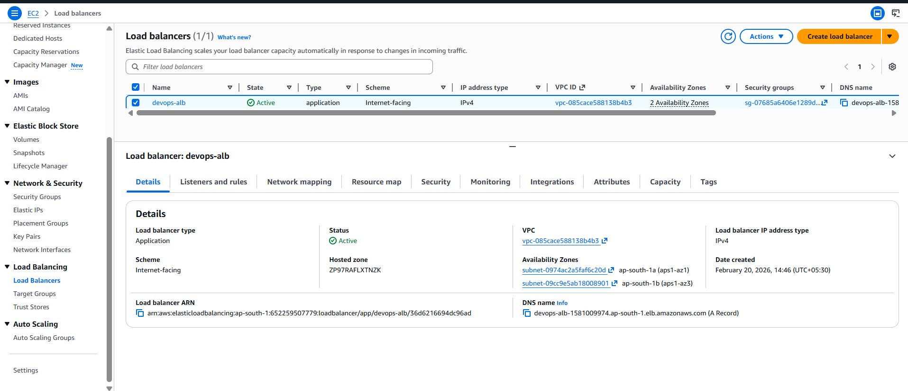
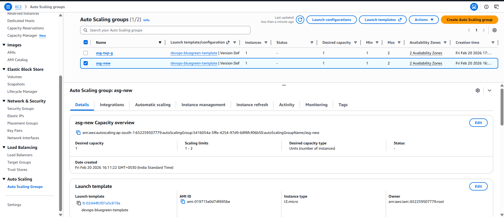

# 🚀 Highly Available & Auto-Scalable Blue-Green Deployment on AWS

> Production-style DevOps implementation demonstrating zero-downtime deployments using AWS, Docker, and CI/CD automation.

---

## 📌 Project Summary

This project implements a fully automated Blue-Green Deployment architecture on AWS for a Dockerized Node.js web application.

It demonstrates:

- High Availability Architecture
- Zero Downtime Deployment
- CI/CD Automation
- Load Balancing
- Auto Scaling
- Secure IAM-based deployment

---

# 🏗 Architecture Overview

```
User → Application Load Balancer → Target Group (Blue / Green)
      → Auto Scaling Group → EC2 → Docker Container
```

---

## 🧱 Core AWS Components Used

| Service | Purpose |
|----------|----------|
| EC2 | Hosts Dockerized application |
| Docker | Containerization |
| Application Load Balancer | Traffic routing |
| Target Groups | Blue & Green environments |
| Auto Scaling Groups | High availability |
| GitHub Actions | CI/CD pipeline |
| DockerHub | Image registry |
| IAM | Secure deployment automation |

---

# 🔄 Blue-Green Deployment Strategy

Two identical environments are maintained:

- 🟦 **Blue** → Stable Production Version
- 🟩 **Green** → New Deployment Version

### Deployment Flow:

1. Developer pushes code to `main`
2. GitHub Actions builds Docker image
3. Image tagged & pushed to DockerHub
4. Green ASG pulls latest image
5. Container restarted automatically
6. ALB traffic switched to Green
7. Zero downtime achieved

---

# ⚙️ CI/CD Pipeline

### Trigger:
Push to `main` branch

### Automated Steps:

- Checkout repository
- Build Docker image
- Tag using GitHub run number
- Push image to DockerHub
- SSH into Green EC2
- Pull latest image
- Restart container
- Switch ALB traffic

---

# 📈 Auto Scaling Configuration

- Minimum Instances: 1
- Maximum Instances: 2
- Multi-AZ deployment
- Health check integrated with ALB
- Automatic replacement of unhealthy instances

---

# 🔐 Security Configuration

- EC2 allows traffic only from ALB Security Group
- SSH restricted to trusted IP
- IAM user created specifically for GitHub deployment
- DockerHub credentials stored securely in GitHub Secrets

---

# 📸 Project Screenshots

## 🏗 AWS Infrastructure

### Application Load Balancer


### Target Groups (Blue & Green)


### Auto Scaling Groups


---

## 🚀 Deployment Validation

### 🟦 Blue Version (Stable)


### 🟩 Green Version (After CI/CD Deployment)


---

## 🔄 CI/CD Automation

### GitHub Actions Successful Run


---

## 🐳 DockerHub Image Repository


---

## 🔐 IAM Deployment User


---

# 🎯 Key DevOps Concepts Demonstrated

- Blue-Green Deployment
- Zero Downtime Release
- CI/CD Automation
- Containerization
- Load Balancing
- Auto Scaling
- Infrastructure Architecture Design
- Secure IAM-based Deployment

---

# 🧠 Interview Talking Points

Be ready to explain:

- Why Blue-Green is better than in-place deployment
- How ALB performs health checks
- How traffic switching works
- How Auto Scaling ensures reliability
- How CI/CD improves release velocity
- How Docker ensures environment consistency

---

# 🔮 Possible Enhancements

- Automated rollback mechanism
- HTTPS using ACM
- CloudWatch monitoring & alerts
- Infrastructure as Code (Terraform)
- Canary deployment strategy

---

# 👨‍💻 Author

**raj** 
DevOps & Cloud Enthusiast  
AWS | Docker | CI/CD | High Availability Architecture

---